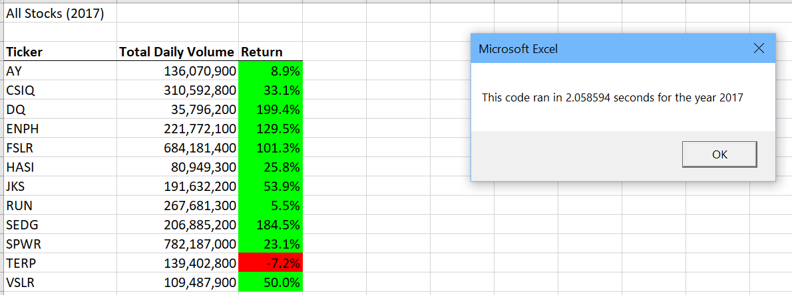
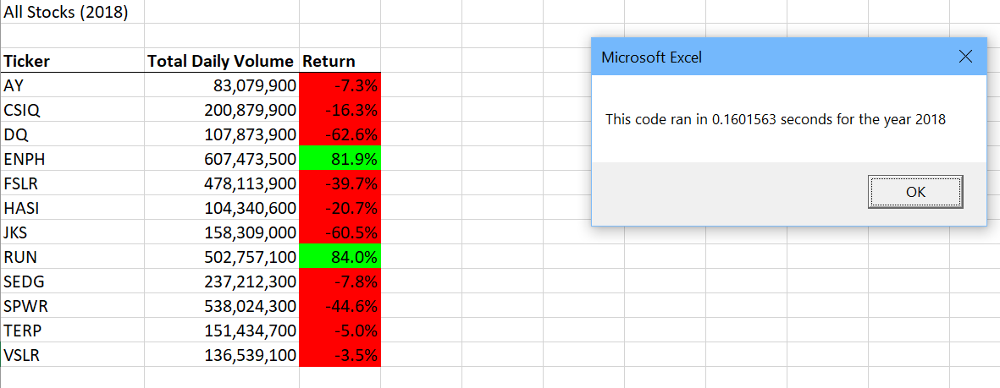
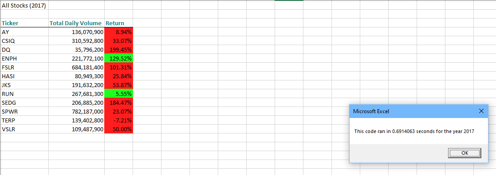
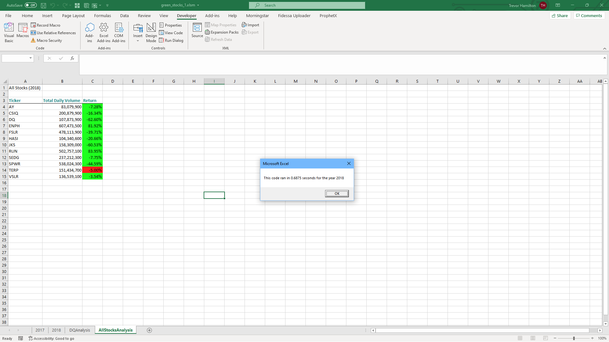

# Stock Analysis

## Overview of Project
+ The purpose of this project was to create a VBA macro code to run yearly stock returns based on 12 stock tickers. The analysis included total daily volume traded for the stock in the selected year, as well as, year over year return for the particular equity. 
## Results
+ The results between 2017 and 2018 are drastically different in regards to over returns. Being able to refactor our code, we were able to speed up macro times for both years. 
+  By refactoring our code, we were able to speed up and make the analysis much more efficeint.  

## Summary
+ Advantages of refactoring code helps improve that we keep the analysis and run times efficient. As you continue to refactor code, you will find certain areas for improvement that allow for quicker run times. While some may see changing and continuing to tinker with the code time consuming, it could end up being the most efficient and most flexible in the long run.
